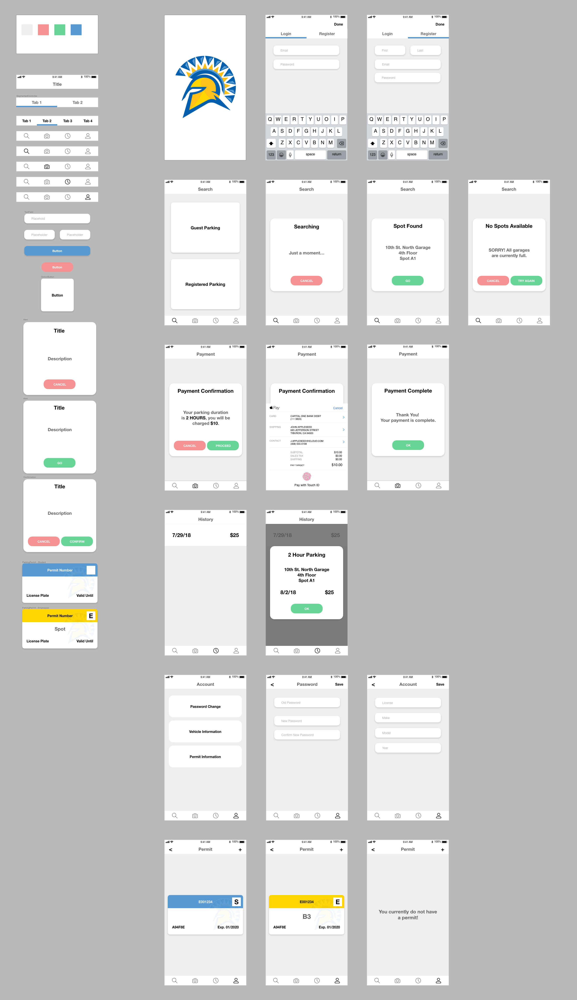

# Spartan Parker
Insufficient parking spaces has always been a problem at the San Jose State
University (SJSU) parking garages when students have classes to attend. Many
students head to school way before their classes begin just to find parking in
the student parking lots. SJSU sells more parking permits than there are parking
spaces, which leaves many students without a parking spot.

SpartanParker aims to provide users, in real-time, the availability of parking
spaces and replace physical parking permits.

## Project Goals and Objectives
The goals and objectives for this project was to build a system that would:
1. Provide real-time status of parking spot availability
2. Eliminate the need for physical parking permits
3. Facilitate payments for parking through a mobile device
4. Provide a web application dashboard for the parking authority for management.

This repository contains the iOS application for users to facilitate payments
through SpartanParker on their mobile devices.

